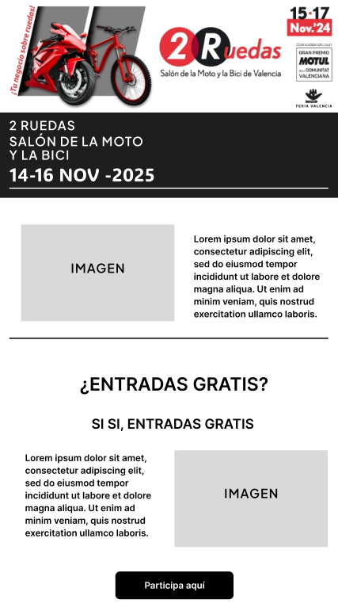

# RETO FERIA VALENCIA  
## SUPUESTO 4  

**Rubén Ramírez Cataluña - 1ºDAM**

---

## ÍNDICE

- ANÁLISIS Y PLANIFICACIÓN  
- DISEÑO  
- TEST CON USUARIOS  
- DESARROLLO Y ENVÍO DE CORREOS  
- INTEGRACIÓN CON REDES SOCIALES  
- CONTROL DE VERSIONES CON GITHUB  
- PERSONALIZACIÓN DEL CORREO MJML  
- VERIFICAR COMPATIBILIDAD CON DIFERENTES CLIENTES DE CORREO  
- DOCUMENTACIÓN FINAL  

---

## ANÁLISIS Y PLANIFICACIÓN

### Análisis de requerimientos

Analizando el mercado, hemos dividido al público en distintos grupos:

- **Público en general** (se encuentra en los 30 años aproximadamente).
- **Asistentes a los circuitos** (el 70% del público presencial tiene menos de 35 años).
- **Plataformas digitales y redes sociales** (el 60% de los fans de MotoGP tienen menos de 35 años, y el 62% se encuentra entre los 18 y los 34 años).

> Teniendo en cuenta estos 3 grupos, nos damos cuenta de que tenemos que enfocar la campaña a un público juvenil.

### DAFO y competencia

**Fortalezas:**

- **Alto interés del premio:** El sorteo de entradas a MotoGP es un gancho potente y de alto valor.
- **Conexión temática:** Relación directa entre feria de motos y evento de motos.

**Debilidades:**

- **Dependencia del sorteo:** Podría perder interés una vez finalizado.
- **Estacionalidad:** Mayor interés en fechas específicas.

**Oportunidades:**

- **Contenido de valor añadido:** Noticias del sector, entrevistas, consejos, etc.
- **Segmentación del público:** Envío de contenido más personalizado.

**Amenazas:**

- **Fatiga de email:** Riesgo de que los correos sean ignorados.

### Objetivo de la campaña

El objetivo principal es **captar una base de datos cualificada** de potenciales visitantes apasionados por el mundo de las motos y los ciclos.

**Objetivos secundarios:**

- Aumentar base de datos de leads.
- Generar expectación y conocimiento de marca.
- Impulsar la venta de entradas.

---

## DISEÑO

### Mockup

Para hacer el mockup he usado **Figma**. Me he centrado en el diseño de la cabecera y footer. El resto se ha dejado con placeholders y texto lorem ipsum.

### Responsive avanzado con MJML

Aunque MJML ya es responsive por defecto, he usado un **media query** para adaptar el botón “Participa aquí” a pantallas menores de 320 píxeles. Así evito desajustes de diseño en móviles muy pequeños.

---

## TEST CON USUARIOS

### Selección de muestra

Usuarios: alumnos, profesores y amigos.

Se les envió un **Google Forms** con preguntas sobre distintos aspectos de la newsletter, puntuando del 1 al 5.

> De momento no se ha rediseñado la newsletter, pero estoy abierto a feedback constructivo.

---

## DESARROLLO Y ENVÍO DE CORREOS

### AWS EC2 + mjml + node.js

1. Se lanzó una instancia EC2 (máquina Ubuntu) en AWS.
2. Se instaló **MySQL** y se creó una base de datos con nombre, correo y ciudad del cliente.
3. Se instaló **Node.js** y librerías:
   - `nodemailer` (envío de correos)
   - `mysql2` (acceso a la base de datos)
   - `mjml` (compilación de plantillas)

El script `app.js`:
- Lee datos de la base de datos.
- Carga `newsletter.mjml`.
- Usa `emailService.js` para enviar correos personalizados.

Archivo `.env`:
- Contiene configuración sensible: base de datos, correo remitente y contraseña.

> Pruebas realizadas con Gmail y Outlook. Correos van a spam inicialmente, lo que afecta la carga de imágenes.

---

## INTEGRACIÓN CON REDES SOCIALES

El público objetivo es joven, por lo que se han usado las plataformas:

- **TikTok:** gracias a sus algoritmos y hashtags.
- **Instagram Reels** y **YouTube Shorts:** para reciclar el contenido vertical.

---

## CONTROL DE VERSIONES CON GITHUB

Repositorio: [https://github.com/ElErreErre/PracticasFeriaValencia](https://github.com/ElErreErre/PracticasFeriaValencia)

- Uso de Git con Visual Studio Code.
- Commits diarios según los avances.
- Primer commit al finalizar una primera versión. Luego, se hacen cambios tras recibir feedback.

---

## PERSONALIZACIÓN DEL CORREO MJML

Para personalizar el asunto y cuerpo del mensaje:

- Se definen **variables** como `{nombre}` en el `app.js`.
- Estas se rellenan automáticamente con los datos de la base de datos.

---

## VERIFICAR COMPATIBILIDAD CON DIFERENTES CLIENTES DE CORREO

Se ha verificado el correcto funcionamiento en:

- **Gmail**
- **Outlook**

> Se han evitado elementos incompatibles como GIFs o carruseles para garantizar compatibilidad.

---

## DOCUMENTACIÓN FINAL

### Guía de usuario

Pasos para participar en el sorteo:

1. **Abre tu Newsletter**: Busca el correo con el asunto "¡Participa en el Sorteo de Entradas para Cheste!".
2. **Lee la Información del Sorteo**.
3. **Haz clic en “¡Participa Aquí!”**.
4. **Rellena el Formulario**: Participaciones válidas hasta el 1 de septiembre.
5. **Confirma tu Participación**.

### Informe final del proyecto

- Objetivo: atraer nuevos usuarios amantes del mundo del motor.
- Herramienta principal: newsletter con sorteo de entradas a MotoGP.
- Apoyo en redes sociales para aumentar el alcance.
- Diseño simple y directo para mantener la atención del usuario.

> Lo más destacable ha sido el **envío automatizado con Node.js** y la participación de usuarios en las pruebas con feedback útil para mejorar el proyecto.
